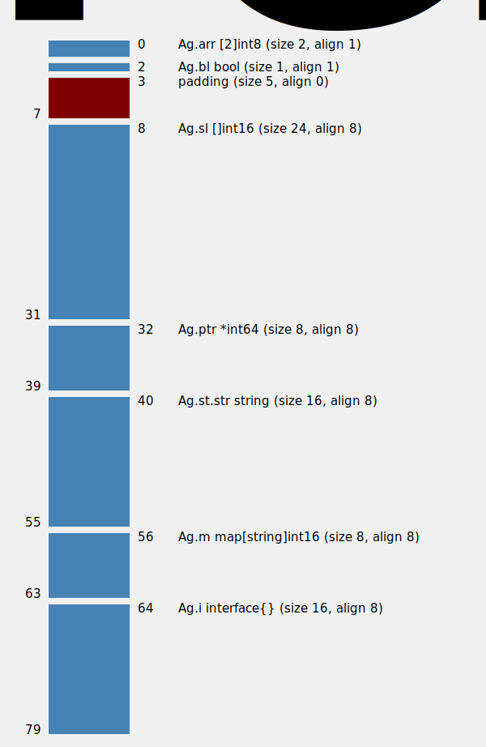
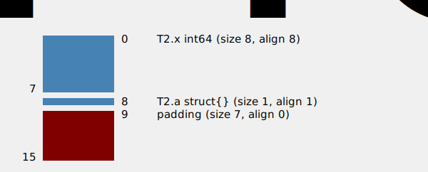
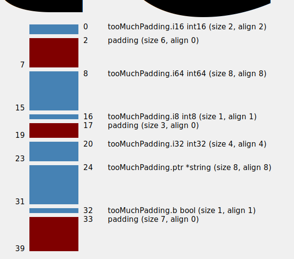

## 图解golang内存对齐

>-- 预留模板 可去除 --
>
>视频连接：b站/油管链接
>
>视频中PPT链接：
>
>视频中代码仓库地址：
>
>作者介绍：
>
>博客地址/github地址：
>
>宣传推广语：
>
>总结语/概述语：通过本视频/本文，你可以收获到xxx
>
>公众号（如有，公众号ID 或 QR code）


- 了解内存对齐的收益
- 为什么需要内存对齐？
- 如何实现内存对齐？
  - 数据结构对齐
  - 内存地址对齐
- 64位字的安全访问保证（32位平台）


#### 收益

-- 提高代码平台兼容性 

-- 优化数据对内存的使用

-- 避免一些内存不对齐带来的坑

有助于一些源码的阅读


#### 为什么要对齐？

| 位 bit              | 计算机内部数据存储最小的单位           |
| ------------------- | -------------------------------------- |
| 字节 byte           | 计算机数据处理的基本单元               |
| 机器字 machine word | 计算机用来一次性处理事务的一个固定长度 |

1、平台原因（移植原因）

不是所有的硬件平台都能访问任意地址上的任意数据的；某些硬件平台只能在某些地址处取某些特定类型的数据，否则抛出硬件异常。


2、性能原因

数据结构应该尽可能地在自然边界上对齐。reason in：为了访问未对齐的内存，处理器可能要做两次内存访问；而对齐的内存访问仅需一次即可访问。


验证代码

```go
package main

import (
	"encoding/json"
	"fmt"
	"sync/atomic"
	"unsafe"
)

func main() {
	alignedAddress()
	shadowField()
	safeAtomicAccess64bitWordOn32bitArch()
	alignPadding()
	zeroField()
}

/*
https://github.com/golang/go/issues/19149
Output will like this, show address is 4bytes aligned, but not consist after mod 8
$ GOARCH=386 go run main.go
290566072 0 290566060 4 290566048 0
$ GOARCH=amd64 go run main.go
824635031404 4 824635031392 0 824635031380 4
*/
type M struct {
	x [3]uint32
}

func alignedAddress() {
	var a, b, c M

	println(
		uintptr(unsafe.Pointer(&a.x)), uintptr(unsafe.Pointer(&a.x))%8,
		uintptr(unsafe.Pointer(&b.x)), uintptr(unsafe.Pointer(&b.x))%8,
		uintptr(unsafe.Pointer(&c.x)), uintptr(unsafe.Pointer(&c.x))%8,
	)
}

// use max align of struct fields
// 64-bit arch: 8-byte aligned; 32-bit arch: 4-byte aligned
// if has gap between fields use padding
func alignPadding() {
	type T1 struct {
		a [2]int8
		b int64
		c int16
	}
	type T2 struct {
		a [2]int8
		c int16
		b int64
	}
	fmt.Printf("arrange fields to reduce size:\n"+
		"T1 align: %d, size: %d\n"+
		"T2 align: %d, size: %d\n",
		unsafe.Alignof(T1{}), unsafe.Sizeof(T1{}),
		unsafe.Alignof(T2{}), unsafe.Sizeof(T2{}))
}

func zeroField() {
	type T1 struct {
		a struct{}
		x int64
	}

	type T2 struct {
		x int64
		// pad bytes avoid memory leak when use address of this final zero field
		a struct{}
	}
	a1 := T1{}
	a2 := T2{}
	fmt.Printf("zero size struct{} in field:\n"+
		"T1 (not as final field) size: %d\n"+
		"T2 (as final field) size: %d\n",
		unsafe.Sizeof(a1), unsafe.Sizeof(a2)) // 16
}

/*
https://golang.org/pkg/sync/atomic/#pkg-note-BUG
On x86-32, the 64-bit functions use instructions unavailable before the Pentium MMX.
On non-Linux ARM, the 64-bit functions use instructions unavailable before the ARMv6k core.
On ARM, x86-32, and 32-bit MIPS, it is the caller's responsibility to arrange for 64-bit
alignment of 64-bit words accessed atomically.
The first word in a variable or in an allocated struct, array, or slice can be relied upon
to be 64-bit aligned.
https://go101.org/article/memory-layout.html#size-and-padding
https://stackoverflow.com/a/51012703/4431337
*/
// GOARCH=386 go run types/struct/struct.go
func safeAtomicAccess64bitWordOn32bitArch() {
	fmt.Println("32位系统下可原子安全访问的64位字：")

	var c0 int64
	fmt.Println("64位字本身：",
		atomic.AddInt64(&c0, 1))

	c1 := [5]int64{}
	fmt.Println("64位字数组、切片:",
		atomic.AddInt64(&c1[:][0], 1))

	c2 := struct {
		val   int64 // pos 0
		val2  int64 // pos 8
		valid bool  // pos 16
	}{}
	fmt.Println("结构体首字段为对齐的64位字及相邻的64位字:",
		atomic.AddInt64(&c2.val, 1),
		atomic.AddInt64(&c2.val2, 1))

	type T struct {
		val2 int64
		_    int16
	}
	c3 := struct {
		val   T
		valid bool
	}{}
	fmt.Println("结构体中首字段为嵌套结构体，且其首元素为64位字:",
		atomic.AddInt64(&c3.val.val2, 1))
	c4 := struct {
		val   int64 // pos 0
		valid bool  // pos 8
		// 或者 _ uint32
		_    [4]byte // pos 9; to correct padding one more 4bytes
		val2 int64   // pos 16
	}{}
	fmt.Println("结构体增加填充使对齐的64位字:",
		atomic.AddInt64(&c4.val2, 1))
	c5 := struct {
		val   int64
		valid bool
		// the first element in slices of 64-bit
		// elements will be correctly aligned
		// 此处切片相当指针，数据是指向底层开辟的64位字数组，如c1
		val2 []int64
	}{val2: []int64{0}}
	fmt.Println("结构体中64位字切片:",
		atomic.AddInt64(&c5.val2[0], 1))

	// 如果换成数组则会panic，
	// 因为结构体的数组的对齐还是依赖于结构体内字段
	//c51 := struct {
	//	val   int64
	//	valid bool
	//	val2  [3]int64
	//}{val2: [3]int64{0}}
	//fmt.Println("结构体中64位字切片:",
	//	atomic.AddInt64(&c51.val2[0], 1))

	c6 := struct {
		val   int64
		valid bool
		val2  *int64
	}{val2: new(int64)}
	fmt.Println("结构体中64位字指针:",
		atomic.AddInt64(c6.val2, 1))

}
func shadowField() {
	type Embedded struct {
		A string `json:"a"`
		B string `json:"b"`
	}
	type Top struct {
		A interface{} `json:"a"`
		// 初始化为空结构体
		Embedded
		// 类似： *Embedded 初始化为空指针 nil
	}

	var a Top
	// B字段被提升，可直接操作
	a.B = "0"
	a.A = 1
	// 不同于a.Embedded.A

	var jsonBytes = []byte(`{"a":["1","2"],"b":"3","a1":"4"}`)

	// 所有 json tag 会被提升用来匹配，遵循同名覆盖规则
	// 所以 tag "a" 会解码到 a.A
	json.Unmarshal(jsonBytes, &a)
	fmt.Printf("unmarshal json with embedded field: %+v\n", a)
	// {A:[1 2] Embedded:{A: B:3}}

	// 若Embedded.A json tag 为a1， 则输出为
	// {A:[1 2] Embedded:{A:4 B:3}}
}
```


验证测试命令

```shell
perflock go test -gcflag='-N -l' github.com/NewbMiao/Dig101-Go/types/struct -bench . -count 3 > old.txt
benchstat old.txt

运行结果
➜  test git:(master) ✗ sh benchstat.sh 3
Will run address-align bench 3 times
name       time/op
UnAligned  46.3µs ±19%
Aligned    33.9µs ±30%
```


benchstat、perflock相关：https://changkun.de/s/gobench/


### 数据结构对齐- 大小保证（size guarantee）

| type                              | size in bytes      |
| --------------------------------- | ------------------ |
| byte，int8，unit8                 | 1                  |
| uint16，int16                     | 2                  |
| uint32，int32，float32            | 4                  |
| uint64，int64，float64，complex64 | 8                  |
| complex128                        | 16                 |
| struct{}，[0]T{}                  | 0                  |
| pointer                           | 4 in x86，8 in x64 |


基于大小保证，有对应的对齐保证

| type                    | align guarantee                  |
| ----------------------- | -------------------------------- |
| bool，byte，int8，unit8 | 1                                |
| uint16，int16           | 2                                |
| uint32，int32           | 4                                |
| float32，complex64      | 4                                |
| arrays                  | 由其元素（element）类型决定      |
| structs                 | 由其字段（field）类型决定        |
| other types             | 一个机器字（machine word）的大小 |

一个机器字的大小是所有类型的最大值，例如，64位系统，机器字18个字节而言，最大也只能按照8字节对齐


### 数据结构（内存）对齐工具

```shell
/# layout （查看）
go get -u github.com/ajstarks/svgo/structlayout-svg
go get -u honnef.co/go/tools
go install honnef.co/go/tools/cmd/structlayout
go install honnef.co/go/tools/cmd/structlayout-pretty

/# optmize
go install honnef.co/go/tools/cmd/structlayout-optmize


使用示例
structlayout code-repo **(struct-name)| structlayout-svg -t "align-guarantee" > ag.svg
```


#### 使用工具 的 示例代码 和 内存对齐结果图

```go
type Ag struct {
	arr [2]int8  // 2
	bl  bool     // 1 padding 5
	sl  []int16  // 24
	ptr *int64   // 8
	st  struct { // 16
		str string
	}
	m map[string]int16
	i interface{}
}
```




<p style="text-align: center">Ag 结构体 内存结构模型图</p>


#### go 实现的内置的 数据结构对齐的 几个对象：string/slice/map/interface


```go
https://github.com/golang/go/blob/master/src/reflect/value.go#L1969

// StringHeader is the runtime representation of a string.
// It cannot be used safely or portably and its representation may
// change in a later release.
// Moreover, the Data field is not sufficient to guarantee the data
// it references will not be garbage collected, so programs must keep
// a separate, correctly typed pointer to the underlying data.
type StringHeader struct {
	Data uintptr
	Len  int
}

---
https://github.com/golang/go/blob/master/src/reflect/value.go#L1980

// SliceHeader is the runtime representation of a slice.
// It cannot be used safely or portably and its representation may
// change in a later release.
// Moreover, the Data field is not sufficient to guarantee the data
// it references will not be garbage collected, so programs must keep
// a separate, correctly typed pointer to the underlying data.
type SliceHeader struct {
	Data uintptr
	Len  int
	Cap  int
}

---
https://github.com/golang/go/blob/master/src/runtime/map.go#L114

// A header for a Go map.
type hmap struct {
	// Note: the format of the hmap is also encoded in cmd/compile/internal/gc/reflect.go.
	// Make sure this stays in sync with the compiler's definition.
	count     int // # live cells == size of map.  Must be first (used by len() builtin)
	flags     uint8
	B         uint8  // log_2 of # of buckets (can hold up to loadFactor * 2^B items)
	noverflow uint16 // approximate number of overflow buckets; see incrnoverflow for details
	hash0     uint32 // hash seed

	buckets    unsafe.Pointer // array of 2^B Buckets. may be nil if count==0.
	oldbuckets unsafe.Pointer // previous bucket array of half the size, non-nil only when growing
	nevacuate  uintptr        // progress counter for evacuation (buckets less than this have been evacuated)

	extra *mapextra // optional fields
}

---
https://github.com/golang/go/blob/master/src/runtime/runtime2.go#L203
interface有两种，一种为指针类型，一种为接口类型（未实现方法）

type iface struct {
	tab  *itab
	data unsafe.Pointer
}

type eface struct {
	_type *_type
	data  unsafe.Pointer
}

// layout of Itab known to compilers
// allocated in non-garbage-collected memory
// Needs to be in sync with
// ../cmd/compile/internal/gc/reflect.go:/^func.dumptabs.
type itab struct {
	inter *interfacetype
	_type *_type
	hash  uint32 // copy of _type.hash. Used for type switches.
	_     [4]byte
	fun   [1]uintptr // variable sized. fun[0]==0 means _type does not implement inter.
}
```


#### 数据结构对齐 特例：final-zero-field

```go
package main

import (
	"fmt"
	"unsafe"
)

type T1 struct {
	a struct{}
	x int64
}

type T2 struct {
	x int64
	a struct{}
}

func main() {
	a1 := T1{}
	a2 := T2{}
	fmt.Printf("zero size of struct with T1 size: %d; T2(as final-zero-field) size: %d", unsafe.Sizeof(a1), unsafe.Sizeof(a2)) // x64：16，x86：12
}

运行结果
-bash-4.2# go run final-zero-field.go
zero size of struct with T1 size: 8; T2(as final-zero-field) size: 16
```


<p style="text-align: center">T1 内存结构模型图</p>



<p style="text-align: center">T2 内存结构模型图</p>


### 数据结构对齐——重排优化（粗暴方式—按对齐值的递减来重拍成员）

tooManyPadding 结构体

```go
type tooMuchPadding struct {
	i16 int16
	i64 int64
	i8  int8
	i32 int32
	ptr *string
	b   bool
}
```



<p style="text-align: center">TooMuchPadding 内存结构模型图</p>


给出优化意见

```
-bash-4.2# structlayout -json struct-align-demo.go tooMuchPadding | structlayout-optimize -r
tooMuchPadding.i64 int64: 0-8 (size 8, align 8)
tooMuchPadding.ptr *string: 8-16 (size 8, align 8)
tooMuchPadding.i32 int32: 16-20 (size 4, align 4)
tooMuchPadding.i16 int16: 20-22 (size 2, align 2)
tooMuchPadding.i8 int8: 22-23 (size 1, align 1)
tooMuchPadding.b bool: 23-24 (size 1, align 1)
```


### 常用静态内存对齐检查工具—— `golangci-lint`

安装 & 使用

```
GO111MODULE=on go get -u github.com/golangci/golangci-lint/cmd/golangci-lint

或 github 下载 rpm/apk 包
```


运行结果

```shell
-bash-4.2# golangci-lint run --disable-all --enable maligned struct-align-demo.go
struct-align-demo.go:19:21: struct of size 40 bytes could be of size 24 bytes (maligned)
type tooMuchPadding struct {
                    ^
```


----


####  内存地址对齐


计算机结构可能要去内存地址进行对齐；也就是说，一个变量的地址是一个因子的倍数，也就是该变量的类型是对齐值。

函数 Alignof 接受一个表示任何类型变量的表达式作为参数，并以字节为单位返回变量（类型）的对齐值。对于变量x：

```go
uintptr(unsafe.Pointer(&x)) % unsafe.Alignof(x) == 0
```

https://golang.org/ref/spec#Package_unsafe


#### 内存地址对齐 🌰——WaitGroup

```go
// A WaitGroup waits for a collection of goroutines to finish.
// The main goroutine calls Add to set the number of
// goroutines to wait for. Then each of the goroutines
// runs and calls Done when finished. At the same time,
// Wait can be used to block until all goroutines have finished.
//
// A WaitGroup must not be copied after first use.
type WaitGroup struct {
	noCopy noCopy

	// 64-bit value: high 32 bits are counter, low 32 bits are waiter count.
	// 64-bit atomic operations require 64-bit alignment, but 32-bit
	// compilers do not ensure it. So we allocate 12 bytes and then use
	// the aligned 8 bytes in them as state, and the other 4 as storage
	// for the sema.
	state1 [3]uint32 // 为什么是[3]uint32，不是[12] byte？
}

// state returns pointers to the state and sema fields stored within wg.state1.
func (wg *WaitGroup) state() (statep *uint64, semap *uint32) {
  // 判断地址是否 8 位对齐
	if uintptr(unsafe.Pointer(&wg.state1))%8 == 0 {
    // 前 8 bytes 做uint64 指针 statep，后 4 bytes做 sema
		return (*uint64)(unsafe.Pointer(&wg.state1)), &wg.state1[2]
	} else { // 否则相反
		return (*uint64)(unsafe.Pointer(&wg.state1[1])), &wg.state1[0]
	}
}
```


WaitGroup 一开始的结构体定义如下 

```go
https://github.com/golang/go/blob/5fea2ccc77eb50a9704fa04b7c61755fe34e1d95/src/sync/waitgroup.go

// A WaitGroup waits for a collection of goroutines to finish.
// The main goroutine calls Add to set the number of
// goroutines to wait for. Then each of the goroutines
// runs and calls Done when finished. At the same time,
// Wait can be used to block until all goroutines have finished.
type WaitGroup struct {
	// 64-bit value: high 32 bits are counter, low 32 bits are waiter count.
	// 64-bit atomic operations require 64-bit alignment, but 32-bit
	// compilers do not ensure it. So we allocate 12 bytes and then use
	// the aligned 8 bytes in them as state.
	state1 [12]byte
	sema   uint32
}

// state returns pointers to the state and sema fields stored within wg.state1.
func (wg *WaitGroup) state() (statep *uint64, semap *uint32) {
	if uintptr(unsafe.Pointer(&wg.state1))%8 == 0 {
		return (*uint64)(unsafe.Pointer(&wg.state1)), &wg.state1[2]
	} else {
		return (*uint64)(unsafe.Pointer(&wg.state1[1])), &wg.state1[0]
	}
}
```


改为 [3]uint32 的原因

```go
https://github.com/golang/go/commit/9ff7df003d770b1dffc984e1861fd009fe08d579

sync: make WaitGroup more space-efficient

The struct stores its 64-bit state field in a 12-byte array to
ensure that it can be 64-bit-aligned. This leaves 4 spare bytes,
which we can reuse to store the sema field.

(32-bit alignment is still guaranteed because the array type was
changed to [3]uint32.)

Fixes #19149.

Change-Id: I9bc20e69e45e0e07fbf496080f3650e8be0d6e8d
Reviewed-on: https://go-review.googlesource.com/100515
Reviewed-by: Dmitry Vyukov <dvyukov@google.com>
Run-TryBot: Brad Fitzpatrick <bradfitz@golang.org>
TryBot-Result: Gobot Gobot <gobot@golang.org>
```


根因：

#### 64位字的安全访问保证（32位系统）


https://golang.org/pkg/sync/atomic/#pkg-note-BUG

## Bugs [¶](https://golang.org/pkg/sync/atomic/#pkg-note-BUG)

- ☞

  On x86-32, the 64-bit functions use instructions unavailable before the Pentium MMX.

  On non-Linux ARM, the 64-bit functions use instructions unavailable before the ARMv6k core.

  On ARM, x86-32, and 32-bit MIPS, it is the caller's responsibility to arrange for 64-bit alignment of 64-bit words accessed atomically. The first word in a variable or in an allocated struct, array, or slice can be relied upon to be 64-bit aligned.


#### 安全访问保证，but why？

```go
The atomic package will panic reading certain int64 values (on go1.1.2 linux/386). In
the following program, atomic will panic when reading the "uncounted" field of
a "WillPanic" struct (but not of the other structs).

package main

import (
  "sync/atomic"
  "log"
)

type WillPass struct {
  uncounted int64
}

type WillAlsoPass struct {
  init      int64
  uncounted int64
}

type WillPanic struct {
  init      bool
  uncounted int64
}

func main() {
  willPass := &WillPass{}
  willAlsoPass := &WillAlsoPass{}
  willPanic := &WillPanic{}
  var n int64 = 2

  atomic.AddInt64(&willPass.uncounted, n)
  log.Printf("willPass count is %d", willPass.uncounted)

  atomic.AddInt64(&willAlsoPass.uncounted, n)
  log.Printf("willAlsoPass count is %d", willAlsoPass.uncounted)

  // Kaboom
  atomic.AddInt64(&willPanic.uncounted, n)
  log.Printf("willPanic count is %d", willPanic.uncounted)
}

➜  golang夜读 git:(master) ✗ GOARCH=386 go run test-386-align.go
2020/10/16 11:41:37 willPass count is 2
2020/10/16 11:41:37 willAlsoPass count is 2
panic: runtime error: invalid memory address or nil pointer dereference
[signal SIGSEGV: segmentation violation code=0x1 addr=0x0 pc=0x33fc]

goroutine 1 [running]:
runtime/internal/atomic.Xadd64(0x11c84024, 0x2, 0x0, 0x1, 0x1)
	/usr/local/Cellar/go/1.12.7/libexec/src/runtime/internal/atomic/asm_386.s:105 +0xc
main.main()
	/Users/pauljobs/Documents/golang夜读/test-386-align.go:35 +0x17a
exit status 2
```


因为 int64 在 bool 之后未对齐

它是 32 位对齐，但不是 64 位 对齐的（如果使用的是 32 位系统，因此实际上只是两个32位值并排在一起）

https://github.com/golang/go/issues/6404#issuecomment-66085602


#### 安全访问保证，but how？

变量 或 已分配（new、make创建出来的） 的结构体、数组或切片中第一个字（word）可以依赖当做是 64 位对齐的。

The first word in struct, array, or slice can be relied upon to be 64-bit-aligned.


示例代码

```go
var c0 uint64
fmt.Println("64位字本身：", atomic.AddInt64(&c0, 1))
c1 := [5]uint64{}
fmt.Println("64位字数组、切片：", atomic.AddInt64(&c1[:][0], 1))
```


源码中的🌰

```go
type p struct{
  ...
  _ uint32 // alignment for atomic fields below
  timer0When uint64
  ...
  pad cpu.CacheLinePad
}
```

GMP中，管理 goroutine 本地队列的上下文p中，记录计时器运行时长的uint64，需要保证32位系统上也是8byte对齐（原子操作）


```go
type mheap struct{
  ...
  _ uint32 // ensure 64-bit alignment for central
  central [numSpanClasses] struct{
    mcentral mcentral
    pad      [cpu.CacheLinePadSize - unsafe.Sizeof(mcentral{}%cpu.CacheLinePadSize)]byte
  }
}
```

堆对象分配的mheap中，管理全局cache的中心缓存列表central，分配或释放需要加互斥锁，另外为了**不同列表间互斥锁**不会伪共享，增加了cacheLinePadding

cacheLine 参考：https://appliedgo.net/concurrencyslower/


在cpu和内存性能gap中添加缓存，去维护数据，减少对内存操作，提高cpu的性能——引申出 数据一致性问题（保证不同cpu之间数据操作，避免缓存失效问题，添加 cacheLine锁维护）


目前发现的内存对齐bug

https://github.com/golang/go/issues/37262 （由于 tinyalloc分配小对象时没有做对齐保证）


### 64位字的安全访问保证 ——无性能要求情况下，加锁！

根因：原子操作，主要是为了避免加锁、避免竞争

```go
c := struct {
  val int64
  val2 int64
}{}
var mu sync.Mutex
mu.Lock()
c.val2 += 1
mu.Unlock()
```


### 总结

- 内存对齐，为了cpu**更高效**访问内存中数据
- 结构体对齐，依赖**类型的大小保证**和**对齐保证**
- 地址对齐保证：如果类型t的对齐保证是n，那么类型t的每个值的**地址**在运行时必须是n的倍数
- struct 内字段如果 **填充** 过多，可以尝试 **重排**，使字段排列更紧密，减少内存浪费
- 零大小字段要避免作为 struct 最后一个字段，否则会有内存浪费
- 32 位系统上对 64位字的原子访问要保证其是 8 bytes对齐的；当然如果非必要的话，还是用 加锁 （`mutex`）的方式更清晰


#### 欧神提问

非常感谢 [@NewbMiao](https://github.com/NewbMiao) 的精彩分享，分享中的内容也是 Go 语言里非常有代表性内存对齐问题，而且内存对齐本身是一个非常重要但鲜有提及的话题。

为此，我希望就分享中内存对齐与否产生的性能差异（第 6-7 页）的内容做进一步的讨论。

首先，分享中提到的性能基准测试及其结果并不是有效的，我们不妨选取性能基准测试中存在几个需要指出的问题。

**问题1**：在 [unsafe 包](https://golang.org/pkg/unsafe/)中说明了 unsafe.Pointer 和 uintptr 之间的转换关系。其中分享中所涉及例子的这几行：

```
address := uintptr(unsafe.Pointer(&x.b)) + 1
if address%ptrSize == 0 {
	b.Error("Not unaligned address")
}
tmp := (*int64)(unsafe.Pointer(address))
```

首先违反了转换规则 2: "Conversion of a uintptr back to Pointer is not valid in general."，换句话说，`address` 这一中间值是无效的，在回转时内存可能已发生移动。虽然我们可能并不关心实际测量中指针操作读写操作是否有效，也知道执行栈不可能发生分裂更不会移动，但展示的时候也并未对这些情况进行说明，同时至少从语言规范层面这也一个无效的程序。

**问题2**：测量样本数较少。在实际展示的结果是基于 3 次测量样本 `-count=3`：

```
name			time/op
UnAligned-6		1.87ns ± 5%
Aligned-6		1.47ns ± 2%
```

可以推算出结果的最坏情况：1.87 * (1-0.05) = 1.78ns，1.47 * (1+0.05) = 1.54ns （取已经观测到的最大误差），最低的提升比例为 (1.78-1.54)/1.78 = 13% 与实际存在的误差比例 5% 相比，结果似乎不那么乐观。

**问题3**：测试环境不可靠。在给出的容器环境下，perflock 是无法锁定操作系统的 CPU 频率，实际结果仍然受 hyperkit 的影响。

```
$ docker run -it --rm golang:1.14-alpine cat /sys/devices/system/cpu/cpu0/cpufreq/scaling_max_freq
cat: can't open '/sys/devices/system/cpu/cpu0/cpufreq/scaling_max_freq': No such file or directory
```

另外，即便是 Linux 下的 cgroup 也仍然不能对计算资源做一个相对稳定的限制。

那么最终这个例子在一台独立的硬件上、简单消除系统噪音后、增加测量样本数后、关闭编译器优化、关闭 GC 、禁用调度器的影响后，一个**初步的性能测试**的结果显示他们**没有区别**：

```
$ GOGC=off GODEBUG=asyncpreemptoff=1 perflock -governor=70% go test -gcflags="-N -l" -run=none -bench=. -count=20 -cpu=1 | tee b.txt
goos: linux
goarch: amd64
BenchmarkUnAligned      529821854                2.26 ns/op
BenchmarkUnAligned      529918800                2.26 ns/op
BenchmarkUnAligned      529877607                2.26 ns/op
BenchmarkUnAligned      529917625                2.26 ns/op
BenchmarkUnAligned      529890981                2.26 ns/op
BenchmarkUnAligned      529885317                2.26 ns/op
BenchmarkUnAligned      529922422                2.26 ns/op
BenchmarkUnAligned      529852632                2.26 ns/op
BenchmarkUnAligned      529926142                2.26 ns/op
BenchmarkUnAligned      529918605                2.27 ns/op
BenchmarkUnAligned      529911817                2.26 ns/op
BenchmarkUnAligned      529887111                2.26 ns/op
BenchmarkUnAligned      529832143                2.26 ns/op
BenchmarkUnAligned      529929664                2.26 ns/op
BenchmarkUnAligned      529842897                2.26 ns/op
BenchmarkUnAligned      529927504                2.26 ns/op
BenchmarkUnAligned      529901169                2.26 ns/op
BenchmarkUnAligned      529930164                2.26 ns/op
BenchmarkUnAligned      529921884                2.26 ns/op
BenchmarkUnAligned      529887153                2.26 ns/op
BenchmarkAligned        529899408                2.26 ns/op
BenchmarkAligned        529910632                2.26 ns/op
BenchmarkAligned        529933194                2.26 ns/op
BenchmarkAligned        529897543                2.26 ns/op
BenchmarkAligned        529922790                2.26 ns/op
BenchmarkAligned        529904359                2.26 ns/op
BenchmarkAligned        529848472                2.26 ns/op
BenchmarkAligned        529909950                2.26 ns/op
BenchmarkAligned        529904179                2.26 ns/op
BenchmarkAligned        529905480                2.26 ns/op
BenchmarkAligned        529927861                2.26 ns/op
BenchmarkAligned        529877383                2.26 ns/op
BenchmarkAligned        529918630                2.26 ns/op
BenchmarkAligned        529917440                2.26 ns/op
BenchmarkAligned        529899174                2.26 ns/op
BenchmarkAligned        529925733                2.26 ns/op
BenchmarkAligned        529929440                2.26 ns/op
BenchmarkAligned        529901206                2.26 ns/op
BenchmarkAligned        529891384                2.26 ns/op
BenchmarkAligned        529874991                2.26 ns/op
PASS
ok      _/home/changkun/dev/tests/align     57.182s
$ benchstat b.txt
name       time/op
UnAligned  2.26ns ± 0%
Aligned    2.26ns ± 0%
```

其次，我们必须明确，对齐与非对齐字段的操作速度差异的基准测试，究竟在度量什么指标，我们是在测量 CPU 执行了多个指令周期吗？我们是在测量 CPU 访问内存的延迟吗？等等。

编写这个性能基准测试并不是一件容易的事情，可以说它比几乎能见到的所有性能基准测试都要难且苛刻。因为它需要彻头彻尾的考虑从底层硬件到语言自身中的所有因素：

- 性能基准测试考虑 CPU 自身优化了吗？性能基准测试考虑缓存的影响了吗？
  - [Intel 处理器的性能优化手册](https://www.intel.com/content/dam/www/public/us/en/documents/manuals/64-ia-32-architectures-optimization-manual.pdf)中描述了大量的执行优化技术，包括对大量优化操作。例如，在 CPU 的写转发技术（当发生写操作时可直接将操作转发到下一个读操作，进而节约CPU的指令周期）。他们对示例代码中未对齐字段优化过了吗？
  - 示例代码所在的测试环境中，未对齐的内存操作是在操作同一个缓存行还是多根缓存行？我们到底是在测量 CPU 访问自身寄存器的速度？还是在测量 CPU 访问缓存的速度？还是还是在测量访问内存的速度？还是其他什么指标呢？
- 性能基准测试考虑操作系统的影响了吗？性能基准测试考虑编译器优化了吗？考虑语言运行时的影响了吗？
  - 系统内核是否在性能测试执行过程中是否发起过硬中断？
  - 编译器优化是否将测试语句直接优化为空操作？
  - 语言运行时对用户态产生过软中断吗？

在我们比较对齐字段和非对齐字段访问速度的差异时，先回答这些问题，远比展示一个执行程序和执行时间的测量结果更加重要。


#### 相关夜读 issue 额外信息

> NewbMiao

感谢欧神的详细分析，这个对齐字段和非对齐字段访问速度访问差异的压测确实很不严谨。

关于不合理的代码：`uintptr->unsafe.pointer`, 替换为直接索引数组元素更合理些

```
ptr := unsafe.Pointer(&x.b[9])
// equal to: unsafe.Pointer(uintptr(unsafe.Pointer(&x.b))+9)
```

另外欧神提到的cpu优化确实没有考虑到，还有好多地方是没有摸到的。

关于cacheLine缓存行影响的话 增加到64bytes (`type SType struct {b [64]byte}`)可以避免，不过结果也是没有什么差异。（我理解，因该是没有并发操作数据让缓存行失效吧）


> 欧神

你说的没错。其实，讨论的目的只是尽可能的让基准测试的结果更加严谨，而不是其他。前面提到的问题也只是这个特殊的基准测试里面直观上需要考虑的问题，仍然还有许多影响因素需要考虑，仅做抛砖引玉。最重要的一点，也是前面反复提到过的，我们在比较对齐字段和非对齐字段访问速度时，这个「速度」究竟指的是什么，似乎始终没有被澄清。

关于这个基准测试在其他系统级语言中已经有比较严谨的做法，但是在 Go 中如何进行严谨的测量，甚至能否给出严谨的测量，我想这些问题这些对分享的听众都是非常有趣的，我也期待更加严谨的示例。